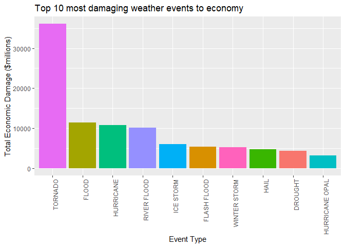

# Title: Analysis of the effect of severe weather events to public health and economy.

# Synopsis
Storms and other severe weather events can cause both public health and economic problems for communities and municipalities. Many severe events can result in fatalities, injuries, and property damage, and preventing such outcomes to the extent possible is a key concern.  

This project involves exploring the U.S. National Oceanic and Atmospheric Administration's (NOAA) storm database. This database tracks characteristics of major storms and weather events in the United States, including when and where they occur, as well as estimates of any fatalities, injuries, and property damage.  

Our analysis found that TORNADO is the weather event with the highest damage to public health and economy.  

# Data Processing
Load libraries and download dataset

```r
library(dplyr)
library(ggplot2)

url <- "https://d396qusza40orc.cloudfront.net/repdata%2Fdata%2FStormData.csv.bz2"
download.file(url, destfile = "StormData.csv.bz2", method = "curl")
```

Read dataset into R object and select data that are needed.

```r
data <-
     read.table(
          "StormData.csv.bz2",
          header = TRUE,
          sep = ",",
          na.strings = "",
          nrows = 368797
     )
data <- select(data, EVTYPE, FATALITIES, INJURIES, PROPDMG, PROPDMGEXP, CROPDMG, CROPDMGEXP)
```

Next we need to adjust the numbers in variables PROPDMG and CROPDMG using exponents in PROPDMGEXP and CROPDMGEXP

```r
# convert all letters to numbers
data$PROPDMGEXP[grep("-|\\?|\\+",data$PROPDMGEXP)] <- 0
data$PROPDMGEXP[grep("[hH]",data$PROPDMGEXP)] <- 2
data$PROPDMGEXP[grep("[kK]",data$PROPDMGEXP)] <- 3
data$PROPDMGEXP[grep("[mM]",data$PROPDMGEXP)] <- 6
data$PROPDMGEXP[grep("[bB]",data$PROPDMGEXP)] <- 9
data$PROPDMGEXP <- as.numeric(data$PROPDMGEXP)
# multiply PROPDMG by exponents in PROPDMGEXP
data$PROPDMG <- data$PROPDMG * (10 ^ data$PROPDMGEXP)

# convert all letters to numbers
data$CROPDMGEXP[grep("-|\\?|\\+",data$CROPDMGEXP)] <- 0
data$CROPDMGEXP[grep("[hH]",data$CROPDMGEXP)] <- 2
data$CROPDMGEXP[grep("[kK]",data$CROPDMGEXP)] <- 3
data$CROPDMGEXP[grep("[mM]",data$CROPDMGEXP)] <- 6
data$CROPDMGEXP[grep("[bB]",data$CROPDMGEXP)] <- 9
data$CROPDMGEXP <- as.numeric(data$CROPDMGEXP)
# multiply CROPDMG by exponents in CROPDMGEXP
data$CROPDMG <- data$CROPDMG * (10 ^ data$CROPDMGEXP)
```


Create a new dataset grouped by event type for the harmful effects to population health.
We will use FATALITIES and INJURIES variables.

```r
harmfulevents <-
     data %>% group_by(EVTYPE) %>% summarise(
          fatalities = sum(FATALITIES, na.rm = TRUE),
          injuries = sum(INJURIES, na.rm = TRUE),
          total = fatalities + injuries
     )
```

Create another dataset for greatest economic consequences. We will use PROPDMG and CROPDMG variables as the proxy for economic damage.

```r
economicdamage <- data %>%
     group_by(EVTYPE) %>% summarise(
          property = sum(PROPDMG, na.rm = TRUE),
          crop = sum(CROPDMG, na.rm = TRUE),
          total = property + crop
     )
```

# Results
#### 1. Across the United States, which types of events (as indicated in the EVTYPE variable) are most harmful with respect to population health?
Let's check the top 10 most harmful events to population health

```r
mostharmful <- head(arrange(harmfulevents, desc(total)), 10) %>% print
```

```
## # A tibble: 10 x 4
##    EVTYPE             fatalities injuries total
##    <chr>                   <dbl>    <dbl> <dbl>
##  1 TORNADO                  4378    75024 79402
##  2 FLOOD                     203     6473  6676
##  3 TSTM WIND                 378     5130  5508
##  4 EXCESSIVE HEAT            736     2582  3318
##  5 LIGHTNING                 341     2172  2513
##  6 ICE STORM                  58     1860  1918
##  7 HEAT                      706      878  1584
##  8 FLASH FLOOD               367      917  1284
##  9 THUNDERSTORM WINDS         64      908   972
## 10 BLIZZARD                   82      777   859
```

**TORNADO** is the most harmful event with the most fatalities and the most injuries.

```r
mostharmful %>% 
     ggplot(aes(x = reorder(EVTYPE, -total), y = total, fill = EVTYPE)) + 
     geom_bar(stat="identity") + 
     ggtitle("Top 10 most harmful weather events to public health") +
     xlab("Event Type") + 
     ylab("Total Harm to population") +
     theme(legend.position = "none", axis.text.x = element_text(angle = 90, hjust = 1))
```

<!-- -->


#### 2. Across the United States, which types of events have the greatest economic consequences?
Let's check the top 10 events with the greatest economic consequences.

```r
mosteconomicdamage <- head(arrange(economicdamage, desc(total)), 10) %>% print
```

```
## # A tibble: 10 x 4
##    EVTYPE             property       crop        total
##    <chr>                 <dbl>      <dbl>        <dbl>
##  1 TORNADO        35916568264.  178048760 36094617024.
##  2 FLOOD           9939354720  1436334050 11375688770 
##  3 HURRICANE       8591011000  2236630000 10827641000 
##  4 RIVER FLOOD     5118945500  5029459000 10148404500 
##  5 ICE STORM       1004302040  5013448500  6017750540 
##  6 FLASH FLOOD     4827942662.  511209100  5339151762.
##  7 WINTER STORM    5287179401    26291000  5313470401 
##  8 HAIL            3517514036. 1179220270  4696734306.
##  9 DROUGHT          199460000  4157721000  4357181000 
## 10 HURRICANE OPAL  3172846000    19000000  3191846000
```

Again, we see **TORNADO** has the greatest economic damage.

```r
mosteconomicdamage %>%
     ggplot(aes(x = reorder(EVTYPE, -total), y = total/1000000, fill = EVTYPE)) + 
     geom_bar(stat="identity") + 
     ggtitle("Top 10 most damaging weather events to economy") +
     xlab("Event Type") + 
     ylab("Total Economic Damage ($millions)") +
     theme(legend.position = "none", axis.text.x = element_text(angle = 90, hjust = 1))
```

<!-- -->
